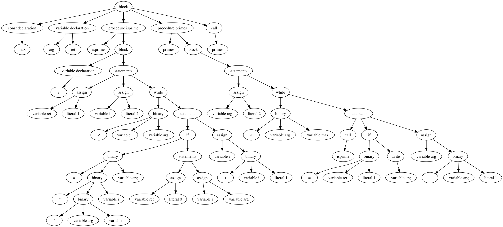

<p align="center">

<br>
<i>– Just another PL/0 interpreter.</i>
</p>


## Features

1. Written in modern C++ and object-oriented paradigm.
2. Be able to generate versatile ast
3. Be able to generate picture of the ast 

## Build

PL/0 uses cmake as its building toolchains, which is available in all platforms. To build PL/0, first and formost, you should clone this project to your computer.
Then you can follow the instructions below:

<details>
<summary>For CLion Users</summary>
If you're using CLion as your C++ IDE, you can load this project directly into CLion by clicking "Import Project from Sources" on the startup screen of CLion.
</details>

<details>
<summary>For macOS Users</summary>
If you're using CLion as your C++ IDE, you can load this project directly into CLion by clicking "Import Project from Sources" on the startup screen of CLion.
</details>

<details>
<summary>For Linux (or Cygwin) Users </summary>
If you're using Linux (or Cygwin). The best way is using GNU make. Just `cd` into this project and execute following command.

```shell
mkdir -p cmake-build
cd cmake-build
cmake .. -G "Unix Makefiles"
```
</details>

<details>
<summary>For Windows Users</summary>
<br>
Make sure that the Microsoft C++ compiler is installed with your Visual Studio. Then execute `cmake .` in this project's directory. CMake will generate Visual Studio solution file automatically.
</details>

## Usage

To run the code in `example` directory with PL/0,  just run the executable binary:

```shell
pl0 ./example/prime.txt
```

<details>
<summary>How to see the bytecode?</summary>
If you want to see the bytecode generated by interpreter internally, just type the same command with `--show-bytecode`:

```shell
pl0 --show-bytecode ./example/prime.txt
```
</details>

<details>
<summary>How to visualize the syntax tree?</summary>
What's more, if you want to visualize the abstract syntax tree, just add `--plot-tree tree.gv` and then use dot to compile generated file into picture:

```shell
pl0 --plot-tree tree.gv ./example/prime.txt
dot -o tree.png -T png tree.gv
```

Then open `tree.png` to see the result.


</details>

<details>
<summary>Are there more options?</summary>
Built binary of PL/0 interpreter has few options:

* `--compile-only`: compile but not run the code
* `--show-bytecode`: print bytecode after generating the code
* `--show-ast`: print ast after generating the ast
* `--plot-tree [output_file]`: save DOT (a graphics description language) into `output_file`, you can generate a picture of the ast by graphviz.
</details>

## Specification of Target Machine

In this section, the target instruction set will be demonstrated. The target runtime environment is a stack-based machine. There are four register and a stack in the target machine.

### Registers and Stack

The purpose of four registers are listed below:

1. `IP` holds the instruction being executed.
2. `PC` is program counter.
3. `SP` refers the top of the stack.
4. `BP` refers the base of current stack frame.

Stack has two purposes: allocate variables and being used as evaluation stack.

Stack is composed of many consecutive storage unit. In order to gain a deeper understanding, we can imagine that stack is composed of many stack frames and each stack frame is composed of many storage units.

When a procedure is called, a new stack frame will be placed at the top of the stack. Vice versa, the stack frame will be removed when the procedure is returned.

But what is inside the stack frame? At the bottom of the stack frame, there are three variables: 

1. Static link is the `BP` register of the procedure in which this procedure is called.
2. Dynamic link is the `BP` register of the procedure in which this procedure is declared.
3. Return address refers to the next instruction when this procedure is returned.

Local variables which declared in this procedure are located beyond three variables. Those are called static zone. Beyond the static zone there is dynamic zone, which is served as evaluation stack.

### Instruction Set

The instruction consists of three parts: opcode, level, address. There are seven opcodes, which is listed below.

1. `LIT`: Load a immediate value onto the stack. The level field in instruction is unused. The address field holds the immediate value.
2. `LOD`: Load a variable onto the stack. The level fields indicates the distance from current stack frame to the stack frame where target variable locates. The address field is the index of target variable.
3. `STO`: Store the value on the top of the stack to a variable. Two fields acts the same as `LOD`.
4. `CAL`: Call a procedure. The level fields indicates the distance from current stack frame to the stack frame where the callee procedure is defined. The address field is the address of first instruction in the callee procedure.
5. `INT`: Allocate some variables at the top of evaluation stack. The level field is unused. The address field is the count of local variables.
6. `JMP`: Unconditionally jump to the address given in address field. The level field is unused.
7. `JPC`: If the value at top of evaluation is falsy (i.e. zero), jump to the address given in address field. The level field is unused.
8. `OPR`: Do the operation decided by the address field.

## License

MIT
